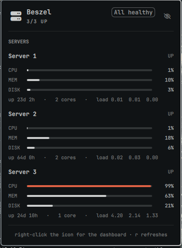
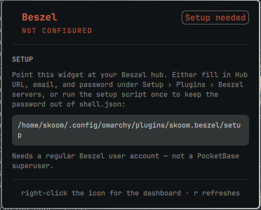

# Beszel servers — an Omarchy bar widget

Watch your [Beszel](https://beszel.dev)-monitored servers from the Omarchy bar.
One icon that turns urgent the moment a server drops or an alert fires, and one
panel with per-server CPU, memory, and disk meters.



## Install

```bash
omarchy plugin add https://github.com/skoom21/omarchy-beszel.git --enable
~/.config/omarchy/plugins/skoom.beszel/setup
```

The first command clones, validates, and enables the widget. The second is a
one-time prompt for your hub URL, email, and password — it verifies them
against the hub before writing anything, and stores them in a `0600` file so
your password never lands in `shell.json`.

Prefer to stay in the GUI? Skip `setup` and fill in **Hub URL**, **Hub email**,
and **Hub password** under *Setup › Plugins › Beszel servers* instead. Until
one of the two is done, the panel tells you exactly what to do:



**Requirements:** Omarchy with the Quickshell bar, `python3` (stdlib only), and
a reachable Beszel hub. Use a regular Beszel **user** account — not a
PocketBase superuser, which the API treats differently.

## What you get

| | |
|---|---|
| **Bar** | A server glyph. Normal colour when everything is up; the theme's red when a server is down, an alert is firing, or the hub is unreachable. Dimmed until configured. |
| **Panel** | Per-server cards: name, UP/DOWN badge, optional subtitle, CPU/MEM/DISK meters, then uptime, core count, and load averages. |
| **Alerts** | A FIRING ALERTS section appears only when Beszel actually has something triggered. |

Meters shift colour by severity — foreground, the theme accent at 75%, red at
90%. A server that is down shows dimmed empty tracks and `—` rather than
freezing its last reading as though it were current.

| Input | Action |
|---|---|
| Left click | Toggle the panel |
| Right click | Open the Beszel dashboard |
| Middle click | Force a refresh |
| `r` | Refresh (panel focused) |
| Arrows | Scroll |
| `Esc` | Close |

## Settings

*Setup › Plugins › Beszel servers*, or under this widget's entry in
`~/.config/omarchy/shell.json`.

| Key | Default | Meaning |
|---|---|---|
| `hubUrl` | — | e.g. `http://localhost:8090` |
| `email` | — | Beszel user account |
| `password` | — | Plain text in `shell.json` — prefer `setup` |
| `credentialsFile` | `~/.config/beszel-status/config` | Override the file location |
| `refreshIntervalSec` | 30 | Poll cadence while the panel is closed |
| `openRefreshIntervalSec` | 5 | Faster cadence while it is open |

Settings win **per field** over the credentials file, so putting the URL in the
GUI while leaving the password in the file works as you would expect.

## The credentials file

```ini
url=http://localhost:8090
email=you@example.com
password=...

# Optional: a subtitle under a server's name in the panel.
# The key must match the system name as it appears in Beszel.
label.web-1=Hetzner · 10.0.0.1
```

Written by `./setup` with mode `0600`. Secrets reach the helper through the
environment, never argv, so they do not show up in `ps`.

## How it works

`Panel.qml` shells out to `bin/beszel-status`, which authenticates against the
hub's PocketBase API, caches its token under `$XDG_CACHE_HOME/omarchy-beszel/`,
and re-authenticates on a 401. The helper always prints valid JSON and always
exits 0, so a hub outage renders as a message in the panel rather than a broken
bar. Run it yourself to see:

```bash
python3 ~/.config/omarchy/plugins/skoom.beszel/bin/beszel-status | jq
python3 ~/.config/omarchy/plugins/skoom.beszel/bin/beszel-status --check
```

`--check` is the human version: it prints one line and sets a real exit code.

## Troubleshooting

| Symptom | Cause |
|---|---|
| Icon dimmed, SETUP card | No URL/email/password resolved yet |
| "Hub rejected those credentials" | Wrong password, or a superuser account instead of a user |
| "Cannot reach hub" | Hub down, wrong port, or a tunnel that is not up |
| "No systems registered" | The hub authenticates but has no systems assigned to that user |
| Icon missing entirely | `omarchy plugin list` — is `skoom.beszel` enabled? |

Force a poll with `omarchy-shell skoom.beszel refresh`, and reload plugin code
with `omarchy-shell shell rescanPlugins`.

## A note on the alert colour

Omarchy maps the shell's `urgent` role from the active theme's plain `red`,
which in some themes is a near-grey that reads as "disabled" rather than
"alert". And `bright_red` is an ANSI slot name, not a luminance promise — some
themes make it the *darker* of the two. So the helper reads `red`,
`bright_red`, and `orange`, computes WCAG contrast against the theme
background, and returns whichever actually reads. It re-checks every poll, so
the colour follows theme changes without a restart.

## Security

Plugins run as unsandboxed code inside your long-lived `omarchy-shell`
process, so this one is written defensively.

**Credentials.** They reach the helper through the environment, never argv, so
they never appear in `ps`. `setup` writes the file `0600` inside a `0700`
directory and reads the password with `read -s`, so it stays out of your shell
history and scrollback. The cached session token is written `0600` in a `0700`
directory, with an explicit `chmod` — `O_CREAT` does not tighten a file that
already exists. The password is never included in the helper's JSON output.

**The hub is treated as untrusted.** A hub you do not control — or one that has
been compromised — is a hostile input source, and the plugin is built to assume
that:

- *Redirects are refused.* `urllib` replays the `Authorization` header across a
  cross-origin redirect, so a hub could otherwise bounce an authenticated
  request to a host it controls and harvest the session token. The Beszel API
  has no legitimate use for a redirect, so one is an error.
- *Hub strings are never markup.* QML `Text` defaults to `Text.AutoText`, which
  auto-detects and renders HTML — a server named
  `` would make the shell issue an
  outbound request. Every `Text` element pins `textFormat: Text.PlainText`.
- *Responses are capped* at 4 MB, so a hostile hub cannot exhaust memory.

**No shell interpolation.** Omarchy's `bar.run()` passes its argument to
`bash -lc`. This plugin never uses it. The dashboard launches through
`Quickshell.execDetached`'s argv form, and only for a string matching an
http(s) allowlist, so neither a crafted `hubUrl` nor a `file://` or
`javascript:` URL can turn a right-click into command execution.

**Transport.** A `https://` hub is encrypted and its certificate is verified.
A plain `http://` hub to anything but loopback sends your password and every
later request in the clear; `setup` warns when you enter one. Prefer `https://`,
or reach a remote hub over an SSH tunnel and point the plugin at `localhost`.

**Storing the password in plugin settings** puts it in `~/.config/omarchy/shell.json`
in plain text, readable by anything running as you and easy to commit to a
dotfiles repo by accident. The settings field is labelled accordingly. Use
`setup` unless you have a reason not to.

## Note for anyone editing this

Do not name a property `data` on the root. `data` is `Item`'s default property
— the list holding its visual children — and shadowing it silently stops every
child of the widget from rendering while still reserving its slot in the bar.
The payload property is called `payload` for exactly that reason.

## License

MIT — see [LICENSE](LICENSE).
